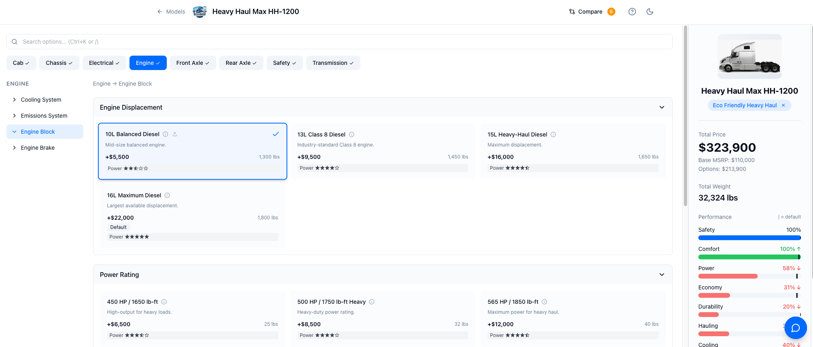

# Digital Twin Truck Configurator

An interactive truck configuration demo built on Snowflake featuring **Cortex Analyst** for natural language optimization queries and **Snowpark Container Services (SPCS)** for hosting the React application.



## Overview

This demo showcases a **Digital Twin** approach to truck configuration where:
- Users configure trucks by selecting components across 40+ component groups
- **Cortex Analyst** powers the "Configuration Assistant" - ask questions like:
  - "Maximize safety and comfort while minimizing all other costs"
  - "What's the best hauling configuration for regional delivery?"
  - "Show me premium options for the Heavy Haul truck"
- Real-time cost and weight calculations update as configurations change
- AI-generated descriptions summarize the configured truck

## Architecture

```
┌──────────────────────────────────────────────────────────────────────────────┐
│                       SPCS Service (TRUCK_CONFIGURATOR_SVC)                  │
│  ┌───────────┐   ┌───────────┐   ┌────────────────────────────────────────┐ │
│  │   nginx   │───│  Next.js  │   │           FastAPI Backend              │ │
│  │  :8080    │   │   :3000   │   │              :8000                     │ │
│  └───────────┘   └───────────┘   └────────────────────────────────────────┘ │
│         │              │                    │                  │             │
│         │              │                    ▼                  ▼             │
│         │              │    ┌─────────────────────┐  ┌──────────────────┐   │
│         │              │    │ Cortex Analyst API  │  │ Cortex Search    │   │
│         │              │    │ (Semantic View)     │  │ (Engineering     │   │
│         │              │    │                     │  │  Docs RAG)       │   │
│         │              │    └─────────────────────┘  └──────────────────┘   │
└──────────────────────────────────────────────────────────────────────────────┘
                                      │                        │
                                      ▼                        ▼
┌──────────────────────────────────────────────────────────────────────────────┐
│                          Snowflake Data Layer                                │
│                                                                              │
│  ┌─────────────┐  ┌─────────────┐  ┌───────────────┐  ┌──────────────────┐  │
│  │  MODEL_TBL  │  │   BOM_TBL   │  │ TRUCK_OPTIONS │  │ ENGINEERING_DOCS │  │
│  │  (5 models) │  │ (253 parts) │  │ (868 mappings)│  │  (uploaded PDFs) │  │
│  └─────────────┘  └─────────────┘  └───────────────┘  └──────────────────┘  │
│         │               │                 │                    │             │
│         ▼               ▼                 ▼                    ▼             │
│  ┌─────────────────────────────────┐           ┌─────────────────────────┐  │
│  │   TRUCK_CONFIG_ANALYST_V2       │           │ ENGINEERING_DOCS_SEARCH │  │
│  │      (Semantic View)            │           │   (Cortex Search Svc)   │  │
│  │  - VQRs for optimization        │           │   - Document chunks     │  │
│  │  - Custom SQL instructions      │           │   - Vector embeddings   │  │
│  └─────────────────────────────────┘           └─────────────────────────┘  │
└──────────────────────────────────────────────────────────────────────────────┘
```

**Key Components:**
- **Cortex Analyst** - Natural language to SQL for truck configuration optimization
- **Cortex Search** - RAG-based search over uploaded engineering documents
- **Semantic View** - Defines relationships between models, options, and mappings with VQRs

## Prerequisites

- Snowflake account with ACCOUNTADMIN privileges (or equivalent)
- Docker Desktop installed
- `snow` CLI installed (`pip install snowflake-cli`)
- Personal Access Token (PAT) for Cortex Analyst API

## Quick Start - Automated Setup (Recommended)

The easiest way to deploy is using the automated setup script:

```bash
# Clone the repository
git clone https://github.com/azbarbarian2020/Digital_Twin_Truck_Configurator.git
cd Digital_Twin_Truck_Configurator

# Run the automated setup
./setup.sh
```

The script will:
1. Prompt for your Snowflake configuration (account, user, warehouse)
2. Create database, schema, compute pool, and image repository
3. Load all data (5 truck models, 253 BOM options, 868 option mappings)
4. Create the semantic view with VQRs
5. Set up PAT authentication
6. Build and push the Docker image
7. Deploy the SPCS service

**Total time: ~10-15 minutes**

---

## Manual Setup (Alternative)

If you prefer to run each step manually:

### Step 1: Clone the Repository
```bash
git clone https://github.com/azbarbarian2020/Digital_Twin_Truck_Configurator.git
cd Digital_Twin_Truck_Configurator
```

### Step 2: Run Infrastructure Setup
```bash
# Connect to your Snowflake account
snow sql -f scripts/01_infrastructure.sql
```

This creates:
- Database `BOM` and schema `BOM4`
- Compute pool `TRUCK_CONFIG_POOL`
- Image repository `TRUCK_CONFIG_REPO`
- External access integration for Cortex API

### Step 3: Load Data
```bash
snow sql -f scripts/02_data.sql
snow sql -f scripts/02b_bom_data.sql
snow sql -f scripts/02c_truck_options.sql
```

### Step 4: Create PAT Secret

1. Go to Snowsight → Your Profile → Security → Personal Access Tokens
2. Create a new token
3. Update the secret:
```sql
CREATE OR REPLACE SECRET BOM.BOM4.SNOWFLAKE_PAT_SECRET
  TYPE = GENERIC_STRING
  SECRET_STRING = '<YOUR_PAT_TOKEN>';
```

### Step 5: Create Semantic View
```bash
snow sql -f scripts/03_semantic_view.sql
```

### Step 6: Build and Push Docker Image

```bash
# Login to Snowflake image registry
snow spcs image-registry login

# Get your registry URL
snow sql -q "SHOW IMAGE REPOSITORIES IN SCHEMA BOM.BOM4"
# Note the repository_url column

# Build for SPCS (must be amd64)
docker buildx build --platform linux/amd64 -t truck-config:v1 docker/

# Tag for Snowflake registry
docker tag truck-config:v1 <YOUR_REGISTRY_URL>/truck-config:v1

# Push to Snowflake
docker push <YOUR_REGISTRY_URL>/truck-config:v1
```

### Step 7: Deploy Service

Update `scripts/05_service.sql` with your account details, then:
```bash
snow sql -f scripts/05_service.sql
```

### Step 8: Get Service URL

```sql
SHOW ENDPOINTS IN SERVICE BOM.BOM4.TRUCK_CONFIGURATOR_SVC;
```

Open the `ingress_url` in your browser!

## Configuration Details

### Account-Specific Values

You'll need to update these in `scripts/05_service.sql`:

| Placeholder | Description | Example |
|-------------|-------------|---------|
| `<ACCOUNT>` | Your Snowflake account | `MYORG-MYACCOUNT` |
| `<USER>` | Your Snowflake username | `JOHN_DOE` |
| `<WAREHOUSE>` | Warehouse for queries | `COMPUTE_WH` |
| `<REGISTRY_URL>` | From SHOW IMAGE REPOSITORIES | `myorg-myaccount.registry...` |

### Semantic View VQRs

The semantic view includes Verified Query References (VQRs) for common optimization patterns:

- `vqr_maximize_safety_comfort_minimize_cost` - Multi-category optimization
- `vqr_maximize_hauling_regional` - Hauling optimization
- `vqr_maximize_safety_regional` - Safety optimization
- `vqr_maximize_power_regional` - Power optimization
- `vqr_minimize_all_costs_regional` - Cost minimization

These ensure the Configuration Assistant generates correct SQL with OPTION_IDs for the Apply button to work.

## Troubleshooting

### Service Won't Start

```sql
-- Check status
CALL SYSTEM$GET_SERVICE_STATUS('BOM.BOM4.TRUCK_CONFIGURATOR_SVC');

-- Check logs
CALL SYSTEM$GET_SERVICE_LOGS('BOM.BOM4.TRUCK_CONFIGURATOR_SVC', 0, 'truck-configurator', 100);
```

### "unauthorized" on Docker Push

```bash
# Re-login to registry
snow spcs image-registry login
```

### Configuration Assistant Not Working

1. Verify semantic view exists:
```sql
SHOW SEMANTIC VIEWS IN SCHEMA BOM.BOM4;
```

2. Verify PAT secret:
```sql
SHOW SECRETS IN SCHEMA BOM.BOM4;
```

3. Test Cortex Analyst directly in Snowsight

### Apply Button Not Showing

The Apply button only appears when the query returns `OPTION_ID`. Check:
- VQRs include `OPTION_ID` in SELECT
- Custom instructions enforce `OPTION_ID` requirement

## Files Structure

```
Digital_Twin_Truck_Configurator/
├── README.md                       # This file
├── scripts/
│   ├── 01_infrastructure.sql       # DB, schema, compute pool, repo
│   ├── 02_data.sql                 # Tables and model data
│   ├── 02b_bom_data.sql           # Full BOM data (253 rows)
│   ├── 02c_truck_options.sql      # Model-option mappings (868 rows)
│   ├── 03_semantic_view.sql       # Semantic view with VQRs
│   └── 05_service.sql             # SPCS service deployment
├── docker/
│   ├── Dockerfile                  # Multi-stage build
│   ├── nginx.conf                  # Reverse proxy config
│   └── (application source)
├── data/
│   └── (CSV exports if needed)
└── docs/
    └── screenshot.png
```

## Updating the Service

**IMPORTANT:** Never DROP and CREATE the service - use ALTER to preserve the URL.

```bash
# Build new version
docker buildx build --platform linux/amd64 -t truck-config:v2 docker/
docker tag truck-config:v2 <REGISTRY>/truck-config:v2
docker push <REGISTRY>/truck-config:v2

# Update service (update image tag in spec)
snow sql -q "ALTER SERVICE BOM.BOM4.TRUCK_CONFIGURATOR_SVC FROM SPECIFICATION \$\$...\$\$"
```

## Demo Scenarios

### 1. Basic Configuration
Select a truck model, explore options across 40+ component groups, and watch real-time cost/weight updates as you make selections.

### 2. AI-Powered Optimization
Open the **Configuration Assistant** panel and ask natural language questions:
- "Maximize hauling for this truck"
- "What's the best safety configuration?"
- "Minimize all costs"

### 3. Multi-Category Optimization
Try complex optimization queries:
- "Maximize safety and comfort while minimizing all other costs"
- Watch as Cortex Analyst recommends optimal parts across all component groups
- Click **"Apply"** to automatically configure the truck with AI recommendations

### 4. Engineering Document Upload (Interactive Demo)

This scenario demonstrates document upload and RAG-based search:

1. **Preparation**: Save the included `605_HP_Engine_Requirements.pdf` to your desktop
   - File is located at: `docker/public/docs/605_HP_Engine_Requirements.pdf`

2. **In the Application**:
   - Select the **Heavy Haul Max HH-1200** or **Executive Hauler EX-1500** model
   - Click on the **"Engineering Docs"** tab
   - Click **"Upload Document"**
   - Select `605_HP_Engine_Requirements.pdf` from your desktop

3. **Ask Questions About the Document**:
   - "What are the requirements for the 605 HP engine?"
   - "Which components are compatible with the 605 HP upgrade?"
   - "What cooling system is required for the maximum power engine?"

4. **See RAG in Action**: The Configuration Assistant uses Cortex Search to find relevant document chunks and answers based on the uploaded engineering specifications.

### 5. Compare Configurations
- Configure two different trucks
- Use the **Compare** feature to see side-by-side differences in cost, weight, and component choices

## License

Internal Snowflake demo - not for distribution.

## Credits

Built by the Snowflake Solutions Engineering team demonstrating:
- Cortex Analyst semantic views
- Snowpark Container Services
- React/Next.js on Snowflake
